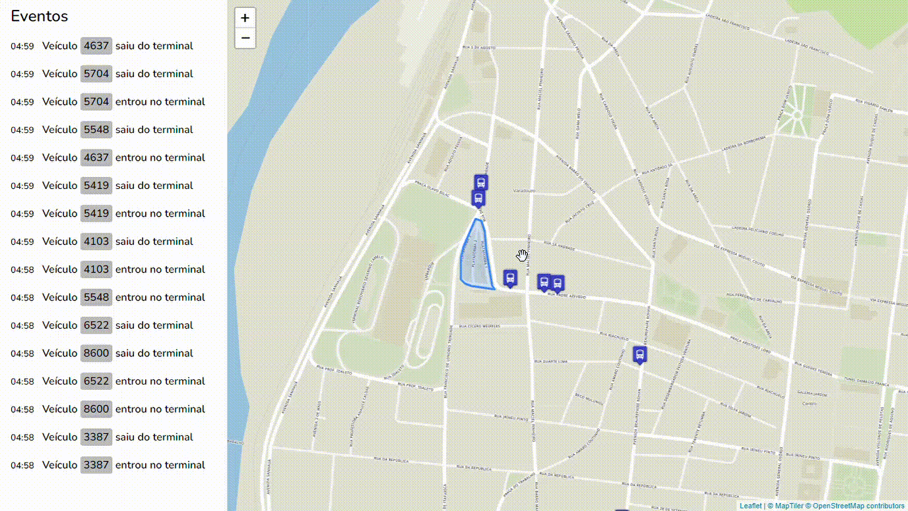

# Bus realtime monitor

An application made with Python and Javascript for monitoring vehicles in real time, using websocket.

Study application.



## Architecture


## Requirements
 - Python >= 3.8.10
 - PostgreSQL with PostGIS extension
 - Redis >= 5.0.5
 - Docker

## Running all services in a local environment

To run services in a local environment, run
```
make run-services
```

To run application for development, first run
```
python3 -m venv venv
source venv/bin/activate
pip install -r requirements.txt
```

This application use GeoDjango, and some geospatial dependencies are required. Please, see [GeoDjango instalation](https://docs.djangoproject.com/en/3.2/ref/contrib/gis/install/).

Create an `.env` file with the following content in the root folder:
```
COMPOSE_PROJECT_NAME=ws-bus
SECRET_KEY=<django-secret-key>
DB_NAME=postgres
DB_USER=postgres
DB_PASSWORD=postgres
DB_HOST=localhost
DB_PORT=5432
DJANGO_SUPERUSER_USERNAME=admin
DJANGO_SUPERUSER_PASSWORD=admin
DJANGO_SUPERUSER_EMAIL=admin@admin.com
```

Create a superuser with
```
make create-su
```

And run database migrations
```
python manage.py migrate
```

Finally, run server
```
python manage.py runserver
```

View the map at [http://127.0.0.1:8000/](http://127.0.0.1:8000/) and access [http://127.0.0.1:8000/gps](http://127.0.0.1:8000/gps) to run a simulation of the GPS data :sunglasses:.

:earth_africa: Geotechnologies :heart_on_fire: